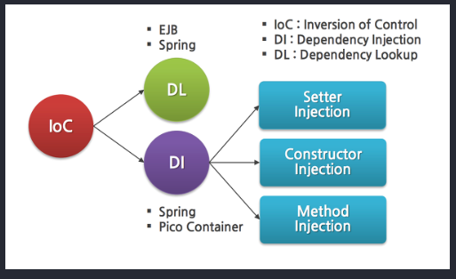
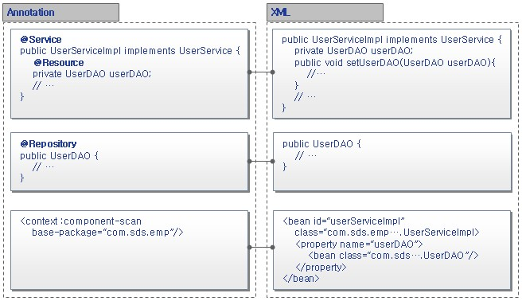
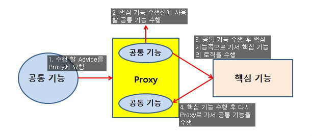
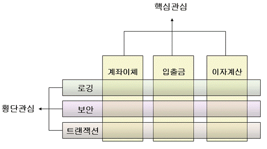

# Spring

스프링 파일 정리

- Maven: 프로젝트 관리 도구(?) (하는일: 구조를 만들어준다.)
- class -> library(jquery) -> frame work(spring)


Spring Bean

- Java 에서는 new 라는걸로 객체 생성
- Spring 에서는 bean으로 생성,


너무 많은 정보들을 README에 쓸 수없으니 블로그에 이어서 작성한다 [가자!](https://choihwan2.github.io/tags/spring)


## 스프링의 특징

1. 여러가지 모듈 단위별
2. 스프링 이전 개발 자바 객체 그대로 재사용 가능.
3. POJO 클래스들도 사용 가능.
4. 다양한 데이터베이스 연결이 가능 Spring ORM or Spring Dao jdbc 등 가능하지만 우리는 mabatis 를 활용한다.


## DI

- IOC (Inversion of Control) 

  ```java
  class A{
  	//B b1 = new B(); //일반적인 객체 생성
      B b1;
      A(B b1){
          this.b1 = b1; //외부에서 전달한 객체로 b1을 생성하는 법.
      }
  }
  ```

  평소에 객체를 만드는 방식으로 만드는 것이 아니라. 만들고자 하는 객체를 스프링에 전달해주면 그걸 스프링이 만들어줌. = `new`가 사라지고 스프링 대신 생성 객체 전달받는다. 



- Dependency Injection (의존성 주입)

  1. 생성자 DI
  2. setter DI

## 환경 설정

pom.xml 안의 

java 버전 1.8 하고 스프링 버전을 4.3.18 로 바꾸고 Properties에서 java build path 에서 자바 버전을 바꾸고 project facets 에서도 java 버전 변경 그리고 runtimes 에서 tomcat 설정


> pojo : 스프링/web/일반 main 재사용이 가능한 자바 객체
>
> 스프링 자바객체 = spring bean


<bean id = "bean이름" class="패키지명.클래스명"//>


- DO : Data object = value object = data transfer object 값 저장 객체

- DAO :  Data access object / jdbc/ io / 네트워크 값이 저장되어있는 곳에 접근해서 값을 가져오는 객체

`ApplicationContext` 는 spring 에서 factory 역활을 해준다.


## 스프링 내부 규칙

1.  스프링 xml 안에서 같은 이름 같은 타입 객체 1개 생성 - 공유 싱글턴 방식으로 생성됨
2.  스프링 공장 생성 객체만 전달.
3.  스프링 규칙대로 강제적


## Annotaion




```java
@Repository("dao")
public class EmpDAO{
    EmpVO vo;
    setVO(EmpVo vo){
        this.vo = vo;
    }
}

@Repository	//"empDAO" 라는 이름으로 객체가 생성됨.
public class EmpDAO{
    @Autowired 	//setVO라는 함수를 대체함
    EmpVO vo;
}

@Component("vo")
public class EmpVO{
    String name;
    double salary;
}
```

위 코드를 사용하기위해서는

```xml
<?xml version="1.0" encoding="UTF-8"?>
<beans xmlns="http://www.springframework.org/schema/beans"
	xmlns:xsi="http://www.w3.org/2001/XMLSchema-instance"
	xmlns:context="http://www.springframework.org/schema/context"
	xsi:schemaLocation="http://www.springframework.org/schema/beans http://www.springframework.org/schema/beans/spring-beans.xsd
		http://www.springframework.org/schema/context http://www.springframework.org/schema/context/spring-context-4.3.xsd">

	<!--@Repository, @Component, @Autowired 설정 인식 표현을 해줘야 인식함.  -->
	<context:component-scan base-package="annotaion.empspring" />
	
	<bean id="vo" class="annotaion.empspring.EmpVO">
		<property name="name" value="김사원"></property>
		<property name="salary" value="10000"></property>
		<property name="deptname" value="영업부"></property>
	</bean>

</beans>

```


## AOP(ASPECT ORIENTED PROGRAMMING)

- aspect : 모든 스프링 클래스 공통 구현 사항들
- 공통관심코드=횡단관심코드=핵심관심코드 구현 공통 필요 반복 구현 사항들





### 사용 하는 방법

1. 스프링 프로젝트 기본 jar 라이브러리 파일들 다운로드
2. aop 관련 라이브러리 추가 [다운로드](https://mvnrepository.com/) 
3. aspect 클래스 정의 (공통관심)
4. target 클래스 정의 (핵심관심)
5. pointcut 문법 (공통(메소드:a) 

```xml
<?xml version="1.0" encoding="UTF-8"?>
<beans xmlns="http://www.springframework.org/schema/beans"
	xmlns:xsi="http://www.w3.org/2001/XMLSchema-instance"
	xmlns:aop="http://www.springframework.org/schema/aop"
	xsi:schemaLocation="http://www.springframework.org/schema/beans http://www.springframework.org/schema/beans/spring-beans.xsd
		http://www.springframework.org/schema/aop http://www.springframework.org/schema/aop/spring-aop-4.3.xsd">
	
	<bean id="member" class="aop1.Member" />
	<bean id="board" class="aop1.Board" />
	<bean id="common" class="aop1.Common" />
	
	<aop:config>
		<aop:pointcut expression="execution (public * aop1.*.*(..))" id="pc"/>
		<!-- modifier 리턴타입 패키지명.클래스명.메소드(매개변수개수) 
		<aop:pointcut expression="execution (public *[리턴타입] aop1[패키지명].*[클래스].*[메소드](..)[매개변수])" id="pc"/>
		* : 모든
		(..) : 모든 매개변수
		.. : 하위패키지 포함
		-->
		<aop:aspect id="aspect1" ref="common">
<!-- 			<aop:before method="a" pointcut-ref="pc"/>
			<aop:after method="b" pointcut-ref="pc"/> -->
			<aop:around method="c" pointcut-ref="pc"/>
		</aop:aspect>
	</aop:config>
</beans>

```


- Annotaion 을 활용한 AOP

```xml
<?xml version="1.0" encoding="UTF-8"?>
<beans xmlns="http://www.springframework.org/schema/beans"
	xmlns:xsi="http://www.w3.org/2001/XMLSchema-instance"
	xmlns:aop="http://www.springframework.org/schema/aop"
	xmlns:context="http://www.springframework.org/schema/context"
	xsi:schemaLocation="http://www.springframework.org/schema/beans http://www.springframework.org/schema/beans/spring-beans.xsd
		http://www.springframework.org/schema/context http://www.springframework.org/schema/context/spring-context-4.3.xsd
		http://www.springframework.org/schema/aop http://www.springframework.org/schema/aop/spring-aop-4.3.xsd">

	<context:component-scan base-package="annotaion.aopexam"> </context:component-scan>
	<aop:aspectj-autoproxy/> <!--Annotaion으로 연결만 잘되어있다면 한방에 해결.. -->


</beans>

```

****


### 참고

- ejb vs spring [링크](https://m.blog.naver.com/sillllver/220593543939)
- Framework 책 27pg
- DI(Dependency Injection) - IoC (https://itgosu.tistory.com/10) + 책 143pg
- AOP(Aspect Oriented Programming) - 관점지향프로그래밍 143pg
- POJO: plain old java object (과거부터 계속해서 쓰여왔던 java 클래스 어디에서나 쓰일수 있음. ex: class B)
     bean 27~후에 나옴.

- MVC - 책313pg

> 스프링은 양방향 응용, 웹 ,모바일 등 다 사용가능,  타 프레임워크랑 호환이 좋음.

- [참고사이트](https://wizcenter.tistory.com/)

> 책은 토비의 스프링 추천해주셨음.